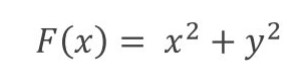
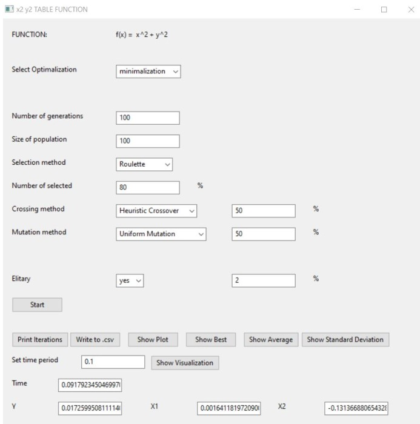
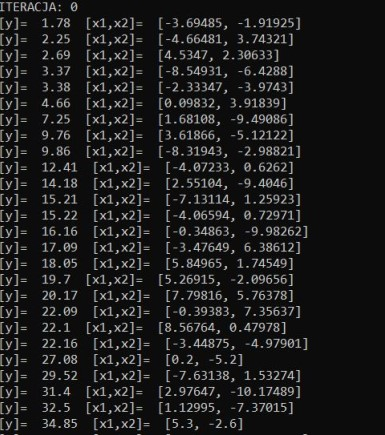
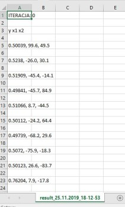
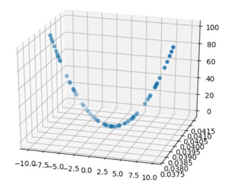
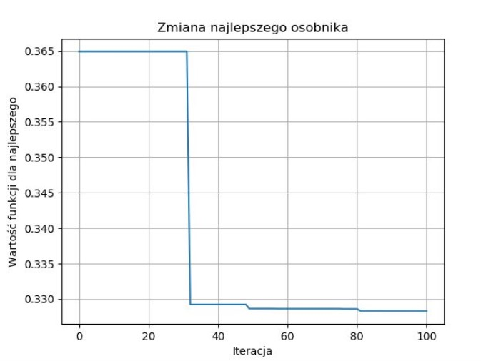
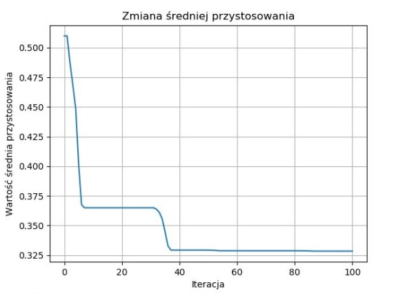
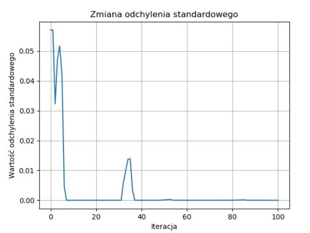
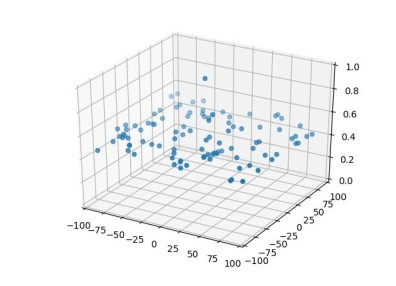

<h1>Chromosome implementation</h1>

Genetic Algorithm

<h2>Function</h2>

variables in the range (-10.10)

Minimum in point 0

<h1>Technologies used</h1>

The application was written in Python.

The environment for running the application is Python 3.7

<h1>Required libraries:</h1>

wx 

time

datetime

pandas

csv

matplotlib.pyplot

numpy 

random

mpl_toolkits.mplot3d

operator 

statistics

math

<h1>Run GUI</h1>

<h2>Print Iterations </h2>

<h2>Save as CSV </h2>

<h2>Show Plot</h2>

Shows the last individuals from iteration in 3D space. With a large number of generations, it is usually one individual.

<h2>

</h2>

<h2>Show Best</h2>

Shows the change in value for the best individual for each iteration.

<h2>Show Average </h2>

Shows the average adaptation of individuals after each iteration

<h2>Show standard deviation</h2>

Shows the value of the standard deviation between individuals from the population for subsequent iterations.

<h2>Show Visualization</h2>

Shows the change in adaptation on the 3D graph for subsequent iterations.

